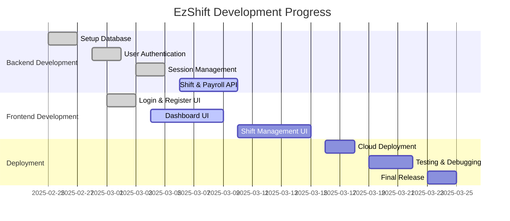

# EzShift

 
 
 
 
 
 
 
 

## Overview
EzShift is a shift management web application designed to help users manage their work schedules and payroll efficiently.

## Features
- User registration and authentication
- Shift scheduling
- Payroll management
- User settings and profile management

## Installation
1. Clone the repository:
   ```sh
   git clone https://github.com/yourusername/EzShift.git
   ```
2. Navigate into the project directory:
   ```sh
   cd EzShift
   ```
3. Install dependencies:
   ```sh
   npm install
   ```
4. Start the server:
   ```sh
   npm start
   ```

## Project Progress


## API Endpoints
- `POST /register` - Registers a new user
- `POST /login` - Authenticates user and sets session cookie
- `GET /logout` - Clears session cookie and logs out user

## License
This project is licensed under the MIT License.
 
